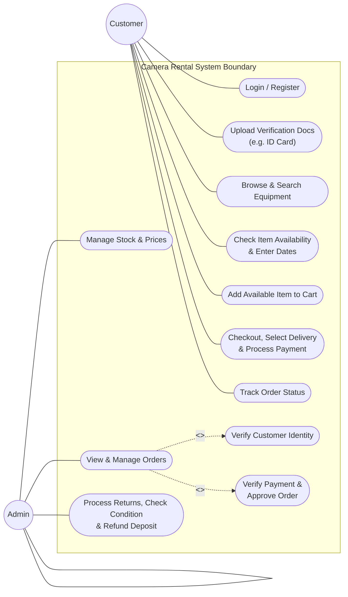
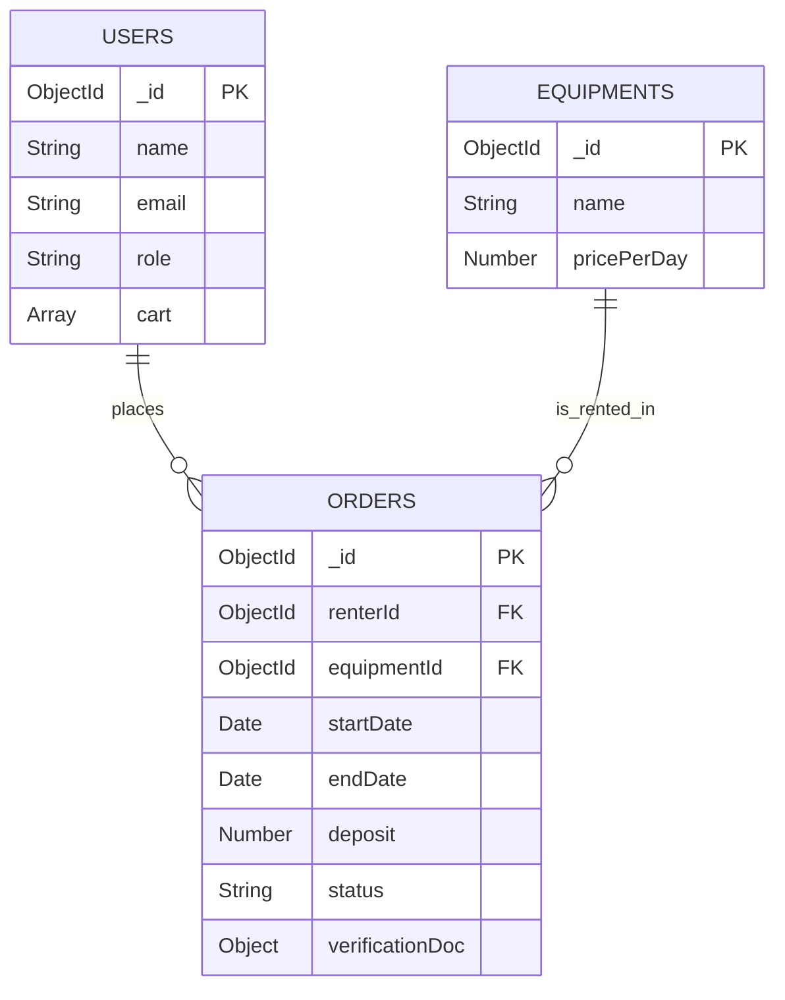

# Camera Rental System - Project Blueprint & Context (Complete Version)

**Generation Thailand - Batch 13 (JSD13)**
_Course Module: Starting Software Projects_

---

## 1. Project Overview & Target Audience

- **Platform Name:** Daily Camera & Lens Rental Web Application
- **Target Users:** ช่างภาพมืออาชีพ, ผู้รักการถ่ายภาพ, หรือ Content Creator ที่ต้องการใช้อุปกรณ์กล้องและเลนส์คุณภาพสูงแบบเฉพาะกิจ (เช่น เลนส์ซูมถ่ายคอนเสิร์ต, แฟลชงานแต่ง) โดยไม่ต้องลงทุนซื้อราคาเต็ม
- **Core Objective:** ระบบร้านค้าออนไลน์แบบ Self-service ที่ช่วยลดภาระงานแอดมินในการตอบแชท โดยปรับปรุงระบบการทำงานให้ลูกค้าเป็นฝ่ายเลือกวันใช้งานก่อน เพื่อความแม่นยำในการเช็กสต็อก

---

## 2. Updated Booking Workflow (ลอจิกการจองแบบเลือกวันก่อน)

เพื่อให้ประสบการณ์ใช้งาน (UX) ลื่นไหลและไม่เสียเวลา ระบบจะทำงานตามลำดับนี้:

1. **Date Selection First:** ลูกค้าเข้าเว็บมาแล้วระบุ "วันเริ่มเช่า - วันคืนของ" เป็นอันดับแรกสุด
2. **Availability Filtering:** ระบบนำช่วงเวลาดังกล่าวไป Query ตรวจสอบใน Database ทันที
3. **Display Available Gear:** หน้าเว็บจะกรองและแสดงเฉพาะกล้องและเลนส์ที่ "สถานะว่าง" ในช่วงเวลานั้นๆ เท่านั้น (ตัวที่ไม่ว่างในช่วงเวลานั้นจะถูกซ่อน หรือขึ้นว่าไม่พร้อมใช้งาน) ทำให้ลูกค้าไม่ต้องกดเลือกของที่ติดจองคนอื่น

---

## 3. Problem Statement vs. Solution Design (อัปเดต)

| ปัญหาเดิม (Manual Process)                                                                                | แนวทางแก้ไขของระบบ (Date-First Automation)                                                                  |
| :-------------------------------------------------------------------------------------------------------- | :---------------------------------------------------------------------------------------------------------- |
| **ลูกค้าเสียเวลาเลือก:** ลูกค้าเลือกกล้องและเลนส์ที่ชอบแทบตาย สุดท้ายแอดมินบอกว่า "ติดคิวคนอื่น"          | **Date-Driven Catalog:** ลูกค้าเลือกวันก่อน ระบบจะคัดกรองเฉพาะของที่ว่างมาให้เลือกช้อปปิ้งทันที ไม่เสียเวลา |
| **แอดมินเช็คคิวพลาด:** ต้องเปิดสมุดคิวหรือปฏิทินร้านดูเทียบวัน เสี่ยงต่อการจองคิวซ้ำซ้อน (Double-booking) | **Automated Timestamp Query:** ระบบใช้ Backend เช็ค overlapping dates ใน Database อัตโนมัติ แม่นยำ 100%     |
| **การคำนวณราคาจัดส่งยุ่งยาก:** ต้องสรุปค่าเช่า มัดจำ และค่าส่งผ่านแชท สรุปราคาผิดบ่อย                     | **All-in-One Checkout:** เลือกร้าน/ส่งของ พร้อมระบบคูณยอดรวมตามจำนวนวันเช่าอัตโนมัติในหน้าเดียว             |

---

## 4. Core System Features (MVP) & Future Roadmap

### Phase 1: Core Minimum Viable Product (MVP)

- **Date Entry Widget:** ส่วนอินพุตระบุวันเช่า-วันคืนที่หน้าแรก หรือด้านบนของเว็บ
- **Browse & Search Catalog:** ค้นหาอุปกรณ์ แยกตามหมวดหมู่ (Body, Lens, Flash) และกรองด้วยวันเช่า
- **Shopping Cart & Checkout:** หน้าตะกร้าสินค้าที่สรุปวันใช้งาน คำนวณราคารวมและมัดจำ พร้อมระบบชำระเงิน
- **Admin Dashboard:** จัดการเพิ่ม/ลดสต็อกสินค้า, อัปเดตราคารายวัน, และจัดการอัปเดตสถานะ (เช่น Pending -> Rented -> Returned)

### Phase 2: Future Expansion (Post-MVP)

- **Loyalty & Condition Points:** ระบบสะสมแต้มสำหรับลูกค้าที่คืนตรงเวลาและดูแลของดี เพื่อใช้เป็นส่วนลดครั้งถัดไป

---

## 5. System Diagrams

### 5.1 Use Case Diagram (UML Standard)

## 6. Database Schema Design (MongoDB NoSQL)

ในการเปลี่ยนมาใช้ MongoDB เราจะใช้หลักการ **Referencing (อ้างอิงไอดี)** สำหรับเชื่อมโยงคอลเลกชันหลัก เพื่อให้ข้อมูลมีความถูกต้องจากแหล่งเดียว (Single Source of Truth) และใช้หลักการ **Embedding (ฝังข้อมูล)** สำหรับระบบตะกร้าสินค้าชั่วคราวรวมถึงข้อมูลสำเนาบัตรประชาชนประจำออเดอร์ เพื่อความปลอดภัยและรัดกุมตามกฎของร้านค้า

---

### 6.1 Data Collections Structure

#### 1. Users Collection

เก็บข้อมูลผู้ใช้งานระบบ ทั้งฝั่งลูกค้า (Customer) และผู้ดูแลระบบ (Admin) พร้อมระบบตะกร้าสินค้า (Cart) แบบฝังตัว

- **`_id`**: ObjectId (Primary Key ที่ MongoDB สร้างให้อัตโนมัติ)
- **`name`**: String (ชื่อ-นามสกุลของผู้ใช้งาน)
- **`email`**: String (อีเมลสำหรับใช้ Login เข้าสู่ระบบ)
- **`password`**: String (รหัสผ่านที่ผ่านการเข้ารหัสลับ/Hashed Password เพื่อความปลอดภัย)
- **`role`**: String (สิทธิ์การใช้งานในระบบ: จำกัดเฉพาะ `'customer'` หรือ `'admin'`)
- **`cart`**: Array of Objects (ตะกร้าสินค้าชั่วคราว ฝังไว้ใน User เพื่อความเร็วในการดึงข้อมูล)
  - `equipmentId`: ObjectId (อ้างอิงไปยังอุปกรณ์ที่เลือก)
  - `quantity`: Number (จำนวนชิ้น)

#### 2. Equipments Collection

เก็บคลังข้อมูลอุปกรณ์กล้อง เลนส์ และไฟแฟลชที่มีให้เช่า โดยไม่มีการเก็บวันจองซ้ำซ้อนในนี้ แต่จะใช้การ Query เช็กช่วงเวลาทับซ้อนจากฝั่ง Order เพื่อความแม่นยำสูงสุด

- **`_id`**: ObjectId (Primary Key)
- **`name`**: String (ชื่อรุ่นและชื่ออุปกรณ์)
- **`brand`**: String (ยี่ห้อ เช่น Canon, Sony, Nikon)
- **`category`**: String (หมวดหมู่อุปกรณ์: `'Body'`, `'Lens'`, `'Flash'`)
- **`pricePerDay`**: Number (ราคาค่าเช่าต่อวัน)
- **`status`**: String (สถานะพร้อมใช้งานของตัวอุปกรณ์เอง: `'available'`, `'maintenance'`)

#### 3. Orders Collection

คอลเลกชันที่เป็นศูนย์กลางหลักในการเชื่อมโยง ทำหน้าที่เก็บประวัติการเช่า ช่วงเวลาที่จอง และหลักฐานยืนยันตัวตนแบบรายครั้ง (Embed) เพื่อใช้ในกระบวนการตรวจสอบของแอดมิน

- **`_id`**: ObjectId (Primary Key)
- **`renterId`**: ObjectId (Reference ID ชี้กลับไปที่ `_id` ของคอลเลกชัน `Users`)
- **`equipmentId`**: ObjectId (Reference ID ชี้กลับไปที่ `_id` ของคอลเลกชัน `Equipments`)
- **`startDate`**: Date (วัน-เวลาที่เริ่มเช่าอุปกรณ์)
- **`endDate`**: Date (วัน-เวลาที่ต้องคืนอุปกรณ์)
- **`deposit`**: Number (ยอดเงินมัดจำประกันอุปกรณ์)
- **`status`**: String (สถานะของออเดอร์: `'pending'`, `'active'`, `'returned'`, `'cancelled'`)
- **`verificationDoc`**: Object (สำเนาเอกสารยืนยันตัวตนที่ฝังไว้เฉพาะออเดอร์นี้ เพื่อความชัวร์ในทุกรอบการเช่า)
  - `idCardImageUrl`: String (ลิงก์ที่อยู่ไฟล์รูปภาพสำเนาบัตรประชาชน)
  - `uploadedAt`: Date (วันเวลาที่อัปโหลดเอกสาร)

---

### 6.2 Data Relationships Mapping

ความสัมพันธ์ของข้อมูลในระบบ NoSQL นี้ ถูกออกแบบให้อยู่ในโครงสร้างแบบ 1-to-Many โดยให้คอลเลกชันศูนย์กลางอย่าง `Orders` เป็นผู้เก็บ Reference ID ของฝั่งตัวตนหลักเอาไว้ สามารถแสดงความสัมพันธ์ผ่าน Diagram ได้ดังนี้:

