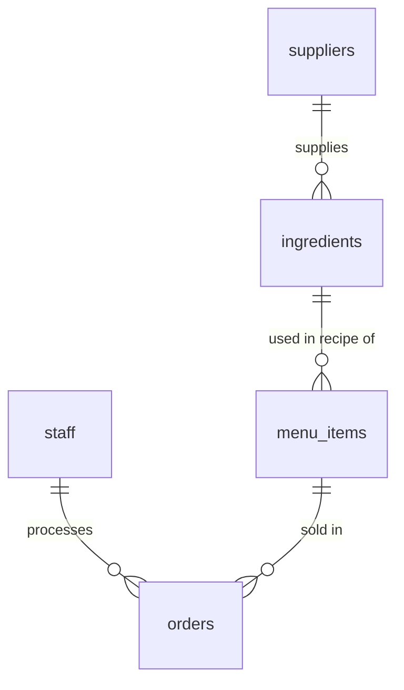

# Chrome Burger Database 🍔

Welcome to the **Chrome Burger Database**! This project is a MongoDB database designed for a modern burger restaurant. It models everything from inventory, staff, and suppliers to menu items and sales orders.

---

## 📁 Repository Structure

The database initialization scripts are located in the [mongoDB/chrome-burger-db/](file:///C:/Users/DoctorDear/Code/JSD13/week-02/first-meet-dbs/mongoDB/chrome-burger-db/) directory. Run them in order to clear existing data and insert the mock datasets:

1. 👤 **[01_suppliers.mongodb.js](file:///C:/Users/DoctorDear/Code/JSD13/week-02/first-meet-dbs/mongoDB/chrome-burger-db/01_suppliers.mongodb.js)**: Initializes raw material suppliers.
2. 👥 **[02_staff.mongodb.js](file:///C:/Users/DoctorDear/Code/JSD13/week-02/first-meet-dbs/mongoDB/chrome-burger-db/02_staff.mongodb.js)**: Configures shop staff (cooks, cashiers).
3. 🥬 **[03_ingredients.mongodb.js](file:///C:/Users/DoctorDear/Code/JSD13/week-02/first-meet-dbs/mongoDB/chrome-burger-db/03_ingredients.mongodb.js)**: Sets up ingredients stock levels and links them to suppliers.
4. 🍔 **[04_menu_items.mongodb.js](file:///C:/Users/DoctorDear/Code/JSD13/week-02/first-meet-dbs/mongoDB/chrome-burger-db/04_menu_items.mongodb.js)**: Defines the menu dishes, pricing, and their required ingredients recipe.
5. 🧾 **[05_orders.mongodb.js](file:///C:/Users/DoctorDear/Code/JSD13/week-02/first-meet-dbs/mongoDB/chrome-burger-db/05_orders.mongodb.js)**: Records transaction orders, containing purchased items and assigning staff handling the order.

---

## 🗺️ Schema & Relationships

Although MongoDB is a NoSQL (Document) database, we have designed the collections with logical references (`ObjectId`) to represent relational associations.

Here is a visual map of how the collections relate to each other:



---

## 🗄️ Collections Explained

### 1. `suppliers`
Stores details of the vendors that supply raw ingredients for the burgers.
- **Fields**:
  - `_id`: `ObjectId` (Primary Key)
  - `name`: `String` (e.g., `"Patty's Premium Meats"`)
  - `contact_person`: `String`
  - `phone_number`: `String`

### 2. `staff`
Maintains records of employees currently working in the shop.
- **Fields**:
  - `_id`: `ObjectId` (Primary Key)
  - `first_name`: `String`
  - `last_name`: `String`
  - `role`: `String` (e.g., `"Cook"`, `"Cashier"`)

### 3. `ingredients`
Represents raw inventory items. Each ingredient references the supplier who provides it.
- **Fields**:
  - `_id`: `ObjectId` (Primary Key)
  - `name`: `String` (e.g., `"Beef Patty"`, `"Brioche Bun"`)
  - `stock_level`: `Number`
  - `unit`: `String` (e.g., `"pcs"`, `"heads"`)
  - `supplier_id`: `ObjectId` (Reference to `suppliers._id`)

### 4. `menu_items`
Contains the burgers and dishes offered on the menu. It includes a sub-document array `recipe` that describes the ingredients and their required quantities.
- **Fields**:
  - `_id`: `ObjectId` (Primary Key)
  - `name`: `String` (e.g., `"Classic Burger"`)
  - `description`: `String`
  - `price`: `Number`
  - `category`: `String` (e.g., `"Burgers"`)
  - `recipe`: `Array` of sub-documents:
    - `ingredient_id`: `ObjectId` (Reference to `ingredients._id`)
    - `quantity_needed`: `Number`

### 5. `orders`
Logs customer transactions. Each order details the total cost, which staff member processed the order, and the items purchased.
- **Fields**:
  - `_id`: `ObjectId` (Primary Key)
  - `order_date`: `Date`
  - `total_price`: `Number`
  - `staff_id`: `ObjectId` (Reference to `staff._id`)
  - `items`: `Array` of sub-documents:
    - `menu_item_id`: `ObjectId` (Reference to `menu_items._id`)
    - `name`: `String`
    - `price`: `Number`
    - `quantity`: `Number`

---

## ⚡ How to Initialize & Run

To set up this database locally:

1. **Start MongoDB**: Make sure you have a local MongoDB instance running (e.g., on `localhost:27017`).
2. **Use VS Code MongoDB Extension**:
   - Open any of the `.mongodb.js` files.
   - Connect to your database server.
   - Click **"Play"** or press `Ctrl + Alt + E` (Windows) to run the file.
3. **Execute Sequentially**: Run scripts `01` through `05` in order. This ensures references match correctly because the data links together through explicit `ObjectId` values.

---

## 📊 Example Aggregation Queries

You can run advanced relational lookups using MongoDB's `$lookup` stage.

### Joining Ingredients with Suppliers
This query joins `ingredients` with `suppliers` to see who supplies each ingredient:
```javascript
db.ingredients.aggregate([
  {
    $lookup: {
      from: "suppliers",
      localField: "supplier_id",
      foreignField: "_id",
      as: "supplier_info"
    }
  },
  { $unwind: "$supplier_info" }
]);
```

### Joining Orders with Staff Details
This query joins `orders` with `staff` to identify which staff member processed each transaction:
```javascript
db.orders.aggregate([
  {
    $lookup: {
      from: "staff",
      localField: "staff_id",
      foreignField: "_id",
      as: "staff_info"
    }
  },
  { $unwind: "$staff_info" }
]);
```
