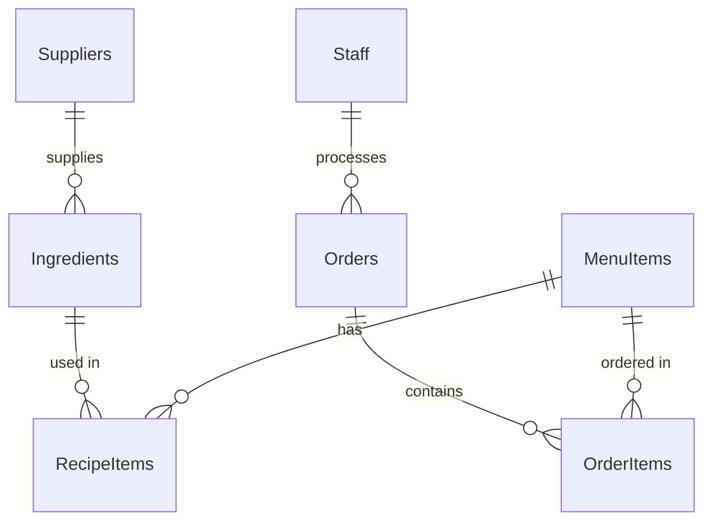
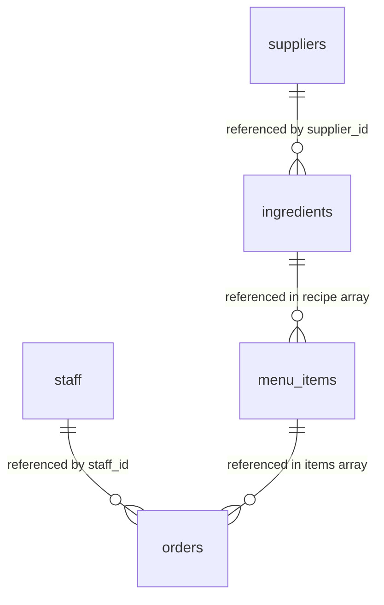

# Chrome Burger Database 🍔

Welcome to the **Chrome Burger Database**! This repository is created for learning database design and queries in the **Junior Software Developer Cohort 13 (JSD13)** program by **Generation Thailand**. 

It models a database for a modern burger restaurant and includes two full implementations of the database:
1. **MongoDB (NoSQL Document Store)**: Showcases document-based models using embedded subdocuments and logical object references.
2. **PostgreSQL (SQL Relational Database)**: Showcases fully normalized table schemas with primary keys, foreign keys, and join tables.

This repository serves as a practical, side-by-side guide for comparing how relational concepts map to document-oriented databases and vice versa.

---

## 📁 Repository Structure

The database schemas and seed datasets are split into two directories:

### 🍃 MongoDB Implementation
The MongoDB initialization scripts are located in the [mongoDB/chrome-burger-db/](file:///c:/Users/DoctorDear/Code/JSD13/week-02/first-meet-dbs/mongoDB/chrome-burger-db/) directory. Run them sequentially to clear existing data and seed the mock documents:

1. 👤 [01_suppliers.mongodb.js](file:///c:/Users/DoctorDear/Code/JSD13/week-02/first-meet-dbs/mongoDB/chrome-burger-db/01_suppliers.mongodb.js): Seeds suppliers for raw materials.
2. 👥 [02_staff.mongodb.js](file:///c:/Users/DoctorDear/Code/JSD13/week-02/first-meet-dbs/mongoDB/chrome-burger-db/02_staff.mongodb.js): Configures restaurant employees (cooks, cashiers).
3. 🥬 [03_ingredients.mongodb.js](file:///c:/Users/DoctorDear/Code/JSD13/week-02/first-meet-dbs/mongoDB/chrome-burger-db/03_ingredients.mongodb.js): Configures raw inventory items linked to their suppliers.
4. 🍔 [04_menu_items.mongodb.js](file:///c:/Users/DoctorDear/Code/JSD13/week-02/first-meet-dbs/mongoDB/chrome-burger-db/04_menu_items.mongodb.js): Defines menu dishes, pricing, and their embedded ingredient recipes.
5. 🧾 [05_orders.mongodb.js](file:///c:/Users/DoctorDear/Code/JSD13/week-02/first-meet-dbs/mongoDB/chrome-burger-db/05_orders.mongodb.js): Records customer transaction orders with embedded purchased items.

### 🐘 PostgreSQL Implementation
The PostgreSQL scripts are located in the [postgreSQL/](file:///c:/Users/DoctorDear/Code/JSD13/week-02/first-meet-dbs/postgreSQL/) directory. They define the schema and populate tables using normalized relational structures:

- 🧱 [create-tables.sql](file:///c:/Users/DoctorDear/Code/JSD13/week-02/first-meet-dbs/postgreSQL/create-tables.sql): Creates the 7 SQL tables, establishing primary and foreign key constraints.
- 👤 [01_suppliers.sql](file:///c:/Users/DoctorDear/Code/JSD13/week-02/first-meet-dbs/postgreSQL/01_suppliers.sql): Seeds raw material suppliers.
- 👥 [02_staff.sql](file:///c:/Users/DoctorDear/Code/JSD13/week-02/first-meet-dbs/postgreSQL/02_staff.sql): Configures restaurant staff.
- 🥬 [03_ingredients.sql](file:///c:/Users/DoctorDear/Code/JSD13/week-02/first-meet-dbs/postgreSQL/03_ingredients.sql): Populates the ingredients table with supplier references.
- 🍔 [04_menu_items.sql](file:///c:/Users/DoctorDear/Code/JSD13/week-02/first-meet-dbs/postgreSQL/04_menu_items.sql): Seeds the menu items table.
- 🔗 [05_recipe-items.sql](file:///c:/Users/DoctorDear/Code/JSD13/week-02/first-meet-dbs/postgreSQL/05_recipe-items.sql): Resolves the many-to-many relationship between menu items and ingredients.
- 🧾 [06_orders.sql](file:///c:/Users/DoctorDear/Code/JSD13/week-02/first-meet-dbs/postgreSQL/06_orders.sql): Populates order records.
- 🛒 [07_order-items.sql](file:///c:/Users/DoctorDear/Code/JSD13/week-02/first-meet-dbs/postgreSQL/07_order-items.sql): Resolves the many-to-many relationship between orders and menu items.
- 🛠️ [connection-guide.md](file:///c:/Users/DoctorDear/Code/JSD13/week-02/first-meet-dbs/postgreSQL/connection-guide.md): Contains instructions for fixing common PostgreSQL/Supabase database connections in VS Code.

---

## 🗺️ Schema & Database Designs

### Relational Schema (PostgreSQL)
In PostgreSQL, schemas are normalized into 7 tables. Many-to-many relationships (e.g., menu item recipes and order item receipts) are resolved via join tables (`RecipeItems` and `OrderItems`):



### Document Schema (MongoDB)
In MongoDB, schemas are denormalized into 5 collections. Instead of creating join tables, relationships are represented via embedded array subdocuments (`recipe` inside `menu_items` and `items` inside `orders`):



---

## 🗄️ Database Mapping Details

| PostgreSQL Table | MongoDB Collection | Relational Pattern vs. Document Pattern |
| :--- | :--- | :--- |
| **Suppliers** | **suppliers** | Rows in table vs. Independent documents. |
| **Staff** | **staff** | Rows in table vs. Independent documents. |
| **Ingredients** | **ingredients** | Table row containing foreign key `supplier_id` referencing `Suppliers`. Document containing reference `supplier_id` referencing `suppliers`. |
| **MenuItems** | **menu_items** | Table row representing the item header. Document representing the item header with an embedded array of recipes. |
| **RecipeItems** | *Embedded inside* **menu_items.recipe** | Join table containing foreign keys `item_id` and `ingredient_id`. Array of subdocuments containing `ingredient_id` and `quantity_needed` nested directly in `menu_items`. |
| **Orders** | **orders** | Table row representing the order header with a foreign key `staff_id` referencing `Staff`. Document representing the order containing a reference `staff_id` and an embedded array of item receipts. |
| **OrderItems** | *Embedded inside* **orders.items** | Join table containing foreign keys `order_id` and `item_id`. Array of subdocuments containing `menu_item_id`, `name`, `price`, and `quantity` nested directly in `orders`. |

---

## ⚡ How to Initialize & Run

### 🍃 Set Up MongoDB Locally
1. **Start MongoDB**: Ensure you have a local MongoDB daemon running (usually on port `27017`).
2. **Open MongoDB Extension in VS Code**:
   - Connect the extension to your local MongoDB server.
   - Open the files in [mongoDB/chrome-burger-db/](file:///c:/Users/DoctorDear/Code/JSD13/week-02/first-meet-dbs/mongoDB/chrome-burger-db/) sequentially.
   - Click the **"Play"** button in the top right or press `Ctrl + Alt + E` (Windows/Linux) to run each file.
3. **Execute Sequentially**: Run `01_suppliers.mongodb.js` through `05_orders.mongodb.js` in order.

### 🐘 Set Up PostgreSQL / Supabase
1. **Connect to PostgreSQL**: Establish a connection to your PostgreSQL database (e.g., local server or Supabase).
2. **Execute Schema**: Run the [create-tables.sql](file:///c:/Users/DoctorDear/Code/JSD13/week-02/first-meet-dbs/postgreSQL/create-tables.sql) script first to set up all tables and relational constraints.
3. **Seed Data Sequentially**:
   - Open and execute scripts `01` through `07` in order. Sequential order is required because foreign key constraints prevent inserting child records before their parent records exist.
4. **Troubleshooting**: If you run into connection configuration errors inside VS Code, refer to [connection-guide.md](file:///c:/Users/DoctorDear/Code/JSD13/week-02/first-meet-dbs/postgreSQL/connection-guide.md).

---

## 📊 Side-by-Side Aggregation & Query Examples

Below is a comparison of how common operations are structured in MongoDB vs. PostgreSQL.

### 1. Joining Ingredients with Suppliers

Find all ingredients and display the name of the supplier supplying them.

#### MongoDB Aggregation (`$lookup`)
```javascript
db.ingredients.aggregate([
  {
    $lookup: {
      from: "suppliers",
      localField: "supplier_id",
      foreignField: "_id",
      as: "supplier_info"
    }
  },
  { $unwind: "$supplier_info" },
  {
    $project: {
      _id: 0,
      ingredient_name: "$name",
      stock_level: 1,
      unit: 1,
      supplier_name: "$supplier_info.name"
    }
  }
]);
```

#### PostgreSQL Query (`JOIN`)
```sql
SELECT 
  i.name AS ingredient_name, 
  i.stock_level, 
  i.unit, 
  s.name AS supplier_name
FROM Ingredients i
JOIN Suppliers s ON i.supplier_id = s.supplier_id;
```

---

### 2. Joining Orders with Staff Details

Identify which staff member processed each transaction order.

#### MongoDB Aggregation (`$lookup`)
```javascript
db.orders.aggregate([
  {
    $lookup: {
      from: "staff",
      localField: "staff_id",
      foreignField: "_id",
      as: "staff_info"
    }
  },
  { $unwind: "$staff_info" },
  {
    $project: {
      _id: 1,
      order_date: 1,
      total_price: 1,
      staff_name: { 
        $concat: ["$staff_info.first_name", " ", "$staff_info.last_name"] 
      },
      staff_role: "$staff_info.role"
    }
  }
]);
```

#### PostgreSQL Query (`JOIN`)
```sql
SELECT 
  o.order_id, 
  o.order_date, 
  o.total_price, 
  CONCAT(s.first_name, ' ', s.last_name) AS staff_name, 
  s.role AS staff_role
FROM Orders o
JOIN Staff s ON o.staff_id = s.staff_id;
```

---

### 3. Displaying Menu Item Recipes

List all menu items alongside their required ingredients and quantities.

#### MongoDB Aggregation (`$unwind` + `$lookup`)
```javascript
db.menu_items.aggregate([
  { $unwind: "$recipe" },
  {
    $lookup: {
      from: "ingredients",
      localField: "recipe.ingredient_id",
      foreignField: "_id",
      as: "ingredient_info"
    }
  },
  { $unwind: "$ingredient_info" },
  {
    $project: {
      _id: 0,
      menu_item: "$name",
      ingredient: "$ingredient_info.name",
      quantity_needed: "$recipe.quantity_needed",
      unit: "$ingredient_info.unit"
    }
  }
]);
```

#### PostgreSQL Query (`JOIN` across 3 tables)
```sql
SELECT 
  m.name AS menu_item, 
  i.name AS ingredient, 
  r.quantity_needed, 
  i.unit
FROM RecipeItems r
JOIN MenuItems m ON r.item_id = m.item_id
JOIN Ingredients i ON r.ingredient_id = i.ingredient_id;
```
