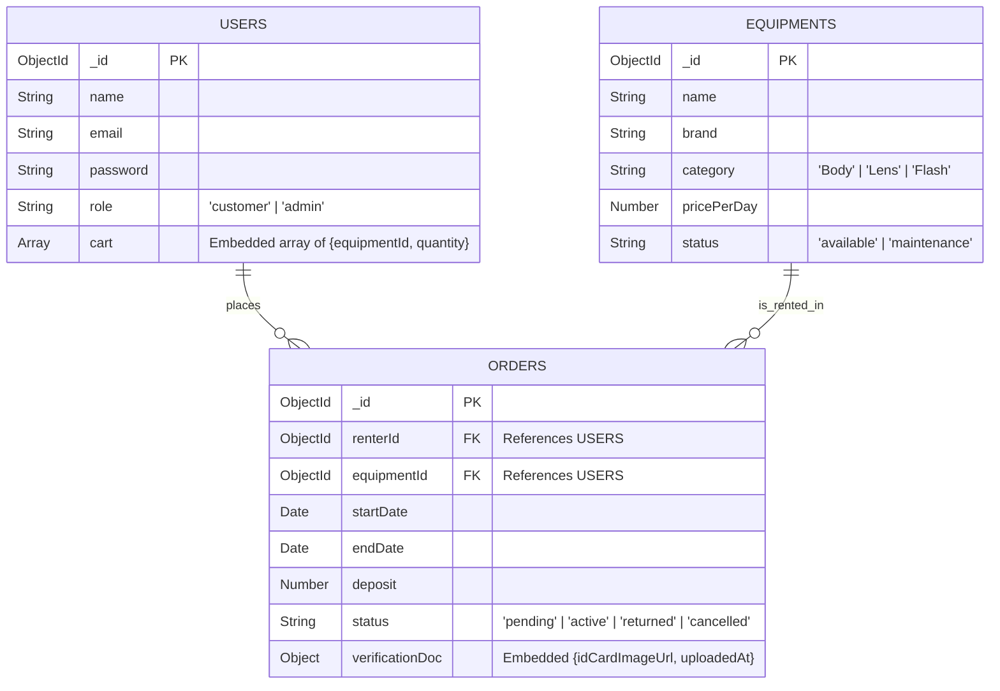
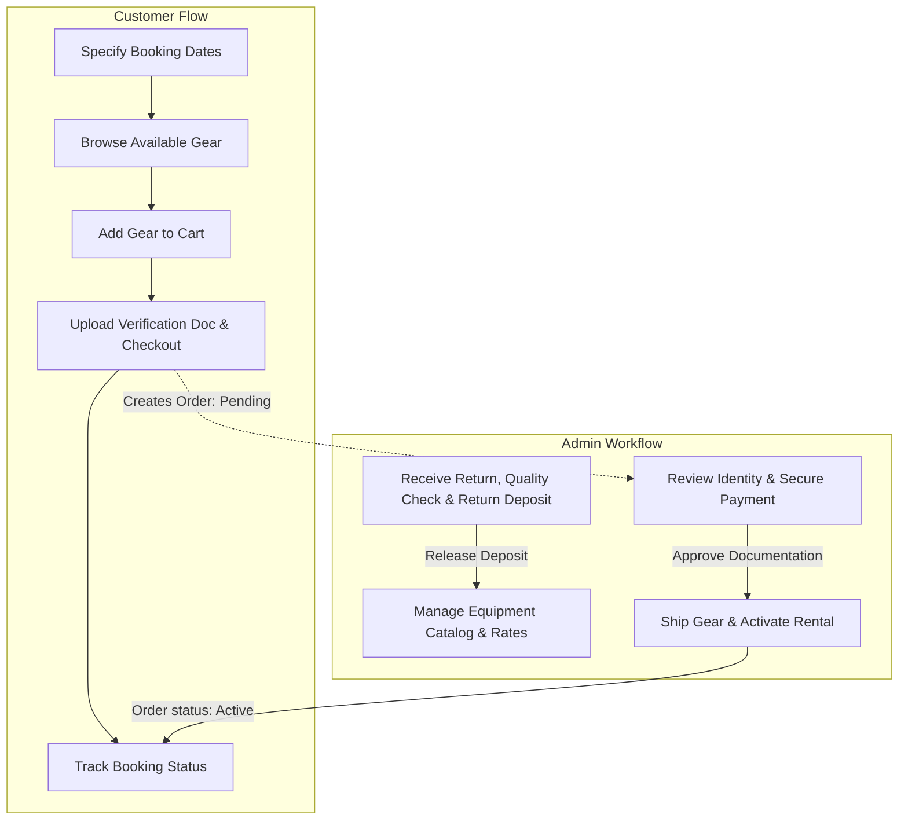

# 📷 Daily Lens & Gear — Camera Rental E-Commerce System

> **Status:** 🚧 Work in Progress (WIP)  
> **Course Module:** Starting Software Projects  
> **Program:** Junior Software Developer Cohort 13 (JSD13) — Generation Thailand

Welcome to **Daily Lens & Gear**! This repository hosts the designs, entity diagrams, and database schemas for an automated, date-driven camera and lens rental platform. 

This project aims to solve the high cost of camera gear ownership and the inefficiencies of manual booking processes by introducing a **"Date-First" self-service web application**.

---

## 🚀 The Core Problem & Our Solution

### 1. High Cost of Ownership (Pain Point)
High-end mirrorless cameras, lenses, and accessories are extremely expensive (ranging from tens of thousands to hundreds of thousands of Baht). Many creators, students, and amateur photographers only need specific gear for specialized shoots (e.g., wedding photography or a weekend portrait session). Buying this gear for one-off use is financially impractical.

### 2. Manual Rental Hassles (Double-Booking & Delay)
Traditional camera rental shops rely heavily on messaging (LINE/Facebook). Admins must manually check schedules, leading to delayed replies and risk of double-booking.
* **Our Solution (Date-Driven Catalog):** The application prompts users to specify their rental dates upfront. The platform automatically queries the database for overlapping schedules and displays only the equipment available during that specific window, ensuring 100% booking accuracy.

---

## 📁 Repository Structure

### 📸 Active Project: Daily Lens & Gear (`03_my-ecommerce-project/`)
The primary project folder is [03_my-ecommerce-project](file:///c:/Users/DoctorDear/Code/JSD13/week-02/first-meet-dbs/03_my-ecommerce-project). It contains all context blueprints and database models for the camera rental platform:
* 📝 [Camera-Rental-System-Context.md](file:///c:/Users/DoctorDear/Code/JSD13/week-02/first-meet-dbs/03_my-ecommerce-project/Camera-Rental-System-Context.md): Complete project context, domain rules, and dataset specification.
* 📈 [01_my-ecomerce-business.md](file:///c:/Users/DoctorDear/Code/JSD13/week-02/first-meet-dbs/03_my-ecommerce-project/01_my-ecomerce-business.md): Business proposal and pain point analysis.
* 🎨 **Visual Designs & Excalidraw Blueprints:**
  - [02_business-model-canvas.excalidraw](file:///c:/Users/DoctorDear/Code/JSD13/week-02/first-meet-dbs/03_my-ecommerce-project/02_business-model-canvas.excalidraw): Business model structure.
  - [03_use-case-diagram.excalidraw](file:///c:/Users/DoctorDear/Code/JSD13/week-02/first-meet-dbs/03_my-ecommerce-project/03_use-case-diagram.excalidraw): Actor boundaries and rental booking use cases.
  - [04_er-diagram.excalidraw](file:///c:/Users/DoctorDear/Code/JSD13/week-02/first-meet-dbs/03_my-ecommerce-project/04_er-diagram.excalidraw): Conceptual entity relations.
* 🗄️ **MongoDB Schema Specifications (JSON Mock Documents):**
  - [05_mongodb-schema_users.json](file:///c:/Users/DoctorDear/Code/JSD13/week-02/first-meet-dbs/03_my-ecommerce-project/05_mongodb-schema_users.json): Customer and Admin entities with embedded shopping carts.
  - [06_mongodb-schema_equipment.json](file:///c:/Users/DoctorDear/Code/JSD13/week-02/first-meet-dbs/03_my-ecommerce-project/06_mongodb-schema_equipment.json): Catalog structure of equipments (Body, Lens, Flash).
  - [07_mongodb-schema_orders.json](file:///c:/Users/DoctorDear/Code/JSD13/week-02/first-meet-dbs/03_my-ecommerce-project/07_mongodb-schema_orders.json): Order receipts containing date-ranges and embedded verification data.

---

### 🍔 Database Fundamentals Practice (Previous Exercises)
The previous SQL and NoSQL practice materials are preserved in these folders for educational reference:
* [01_mongoDB](file:///c:/Users/DoctorDear/Code/JSD13/week-02/first-meet-dbs/01_mongoDB): Practice queries and initialization files for MongoDB based on the Chrome Burger Restaurant concept.
* [02_postgreSQL](file:///c:/Users/DoctorDear/Code/JSD13/week-02/first-meet-dbs/02_postgreSQL): Fully normalized schemas, tables, and relational script practices.

---

## 🗺️ Entity Relationship (ER) Diagram

The system utilizes MongoDB to store data. We resolve relationships using **Referencing** for core records (Users, Equipments) and **Embedding** for context-specific records (e.g., active user carts, or order verification images upload at check-out) to guarantee database integrity.



---

## 🛠️ Date-First Availability Query Logic

To ensure that the customer cannot book equipment that overlaps with existing rentals, the backend performs a search constraint.

An equipment item is considered **occupied** for a requested window `[RequestedStart, RequestedEnd]` if there exists an order where:

$$\text{startDate} \le \text{RequestedEnd} \quad \text{AND} \quad \text{endDate} \ge \text{RequestedStart}$$

### MongoDB Availability Query Example:
```javascript
// 1. Fetch IDs of all equipments currently booked during the user-requested window
const unavailableEquipmentIds = await db.orders.distinct("equipmentId", {
  status: { $in: ["pending", "active"] },
  startDate: { $lte: RequestedEndDate },
  endDate: { $gte: RequestedStartDate }
});

// 2. Query available items in the catalog that are NOT in the unavailable IDs list
const availableItems = await db.equipments.find({
  _id: { $nin: unavailableEquipmentIds },
  status: "available"
});
```

---

## 👥 Booking Workflow & Boundaries

The workflow coordinates between the **Customer** checking out gear and the **Admin** validating requests:



---

## 📅 Roadmap & MVP Checklist

### Phase 1: Core Minimum Viable Product (MVP)
* [ ] **Date-Selector Interface:** Require users to select dates first to drive catalog search filters.
* [ ] **Catalog Overlap Filter:** Dynamic Mongo queries filtering out conflicting dates.
* [ ] **Checkout System:** Automatic rental duration calculation and deposit engine details.
* [ ] **Verification Upload:** Portal to upload security document images per checkout.
* [ ] **Admin Dashboard:** Order pipeline tracker (`pending` ➡️ `active` ➡️ `returned` ➡️ `closed`).

### Phase 2: Future Additions
* [ ] **Damage Insurance Tiers:** Opt-in insurance coverage packages.
* [ ] **Loyalty Points & Benefits:** Priority booking for reliable renters who return gear on time.
